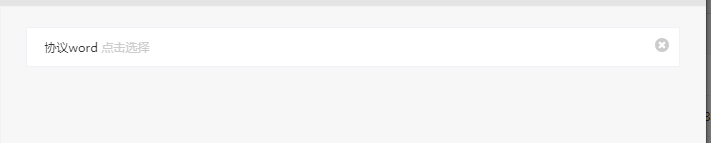

# 新建表单样式说明（\_addFrom.scss）（作者：周佳荣）

# 表单基础框架

```html
<div class="m-form-wrap add-edit-form">//当为弹窗显示样式时使用center-edit-form
    <div class="add-edit-title">
        <span class="icon-title"></span>基本信息
    </div>
    <div class="m-table-from">
        <div class="m-form-row bg-gray">
            <span class="table-name">类型</span>
            <span class="table-text"></span>
            <i class="table-clear" ng-click=""></i>
        </div>
    </div>
</div>
```

样式说明：

* m-form-wrap:表单基础样式
* center-edit-form:为弹窗显示时候的样式
* add-edit-form：新建时候的表单样式
* add-edit-title：标题样式
* m-table-from：下面的 m-form-row 一定要写在这里面，否则第一条 row 的上边线会没有
* icon-title：标题左边 icon 样式
* bg-gray：置灰
* m-table-from：表单外框（自适应，根据外界大小概念）
* m-form-row：列表中的一行，一些通用样式定义，内部子层 flex 布局
* table-name：表单的键名（key）的样式
* table-text：表单的值得样式
* table-name,table-text：在 p 标签内为 flex 布局。table-text 会自适应
* table-clear：删除按钮样式

# Select 元件

```html
<span class="table-name">合同名称</span>
<span class="table-text">
    <select name="" ng-model="" ng-options="">
        <option></option>
    </select>
    <label class="select-tip" ng-show="" >点击选择</label>
</span><!--  -->
<i class="table-clear" ng-click=""></i>
```

样式说明

* 放在 table-text 内
* select-tip：placehold 样式，根据 select 绝对定位
* table-clear：删除按钮样式

# Input[text]元件

```js
<span class="table-name">合同名称</span>
<span class="table-text">
    <input type="text"  name="" ng-model="" placeholder="点击输入" maxlength="50">
</span>
```

样式说明

* 放在 table-text 内
* table-clear：删除按钮样式
* Input 自适应

# Input[radio] 行内元件

```html
<span class="u-radio-box">
    <label class="radio">
        <input type="radio" name="ccc" ng-model="" value="1" checked>是
    </label>
    <label class="radio">
        <input type="radio" name="ccc" ng-model="" value="2">否
    </label>
    <label class="radio">
        <input type="radio" name="ccc" ng-model="" value="3">否1
    </label>
</span>
```

样式说明

* Name 要统一
* u-radio-box：自适应样式，可放任意位置
* Radio：一些 radio 的通用样式

效果：


# Input[radio] 多行元件

```html
<span class="u-radio-box">
    <label class="radio">
        <input type="radio" name="ccc2" ng-model="" value="1" checked>是
    </label>
</span>
<span class="u-radio-box">
    <label class="radio">
        <input type="radio" name="ccc2" ng-model="" value="2" >是1
    </label>
</span>
<span class="u-radio-box">
    <label class="radio">
        <input type="radio" name="ccc2" ng-model="" value="3" >是2
    </label>
</span>
```

样式说明

* Name 要统一
* u-radio-box：自适应样式，可放任意位置
* Radio：一些 radio 的通用样式

效果:


# Input[CheckBox]行内元件

```html
<span class="u-checkBox-box">
    <label class="checkBox">
        <input type="checkBox" name="ccc" value="1" checked>是
    </label>
    <label class="checkBox">
        <input type="checkBox" name="ccc" value="2">否
    </label>
    <label class="checkBox">
        <input type="checkBox" name="ccc" value="3">否1
    </label>
</span>
```

样式说明

* Name 要统一
* u-checkBox-box：自适应样式，可放任意位置
* checkBox：一些 checkBox 的通用样式

效果：


# Input[CheckBox]多行元件

```html
<span class="u-checkBox-box">
    <label class="checkBox">
        <input type="checkBox" name="ccc2" value="1" >是
    </label>
</span>
<span class="u-checkBox-box">
    <label class="checkBox">
        <input type="checkBox" name="ccc2" value="2" >是1
    </label>
</span>
<span class="u-checkBox-box">
    <label class="checkBox">
        <input type="checkBox" name="ccc2" value="3" >是2
    </label>
</span>
```

样式说明

* Name 要统一
* u-checkBox-box：自适应样式，可放任意位置
* checkBox：一些 checkBox 的通用样式

效果：


# textarea 元件

```html
<div class="add-edit-title">
    <span class="icon-title"></span>班次说明
</div>
<div class="m-textarea-box">
    <textarea class="u-table-textarea" ng-model="class.intro" maxlength="300"></textarea>
    <span class="u-textarea-num">
    <span>{{class.intro.length ? class.intro.length:0}}</span>/300
    </span>
</div>
```

样式说明

* 放在 m-textarea-box 内
* textarea-num：根据 m-textarea-box 绝对定位
* u-table-textarea：textarea 的一些样式

效果：


# ui-select

```html
<span class="table-text">
    <ui-select class="uiSelect" ng-model="editModal.data.institution_obj" theme="select2" class="form-control" title="点击选择"
                                    on-select="editModal.selectFun2($item)">
        <ui-select-match placeholder="点击选择">{{$select.selected.nickname}}</ui-select-match>
        <ui-select-choices repeat="item in  uiModel.selectList.institutionList | propsFilter: {nickname: $select.search}">
            <span ng-bind-html="item.nickname | highlight: $select.search"></span>
        </ui-select-choices>
    </ui-select>
</span>
<i class="table-clear" ng-click="editModal.data.institution_obj ={institution_id : '',nickname :''};"></i>
```

样式说明

* 放在 table-text 内
* uiSelect：一些 uiselect 的修改样式

效果：


# 时间

```html
<span class="table-text">
    <span class="u-time-box">
        <input id="start_time1" type="text" class="startTime" time-value=""  format="yyyy-MM-dd"
                                            ng-model="" max-date="#F{$dp.$D(\'end_time1\')}" time-module
                                            readonly placeholder="点击选择">
        <span class="time-division" ng-show="editModal.data.start_time">至</span>
        <input id="end_time1" type="text" class="endTime" ng-show="editModal.data.start_time" time-value=""  format="yyyy-MM-dd"
                                        ng-model="" min-date="#F{$dp.$D(\'start_time1\')}" time-module
                                        readonly placeholder="点击选择">
        </span>
</span>
```

样式说明

* 放在 table-text 内
* u-time-box：时间控件的盒子样式：
* startTime：开始时间样式
* endTime：结束时间样式

效果：


# 上传

```html
<span class="table-text">
    <span class="u-upload-btn-box">
        <a href="javascript:void(0)" ng-if="uploadWordFile.name" ng-bind="uploadWordFile.name"></a>
        <span class="upload-show" ng-if="!uploadWordFile.name">点击选择</span>
        <input class="upload-hide" type="file" id="file" onchange="angular.element(this).scope().uploadWord_M.fileAdd()" accept="application/msword,application/vnd.ms-works">
    </span>
</span>
```

效果：


# 表格

```html
<div class="u-table-form">
    <table class="table-marging table-fixed">
        <thead>
            <tr>
                <th width="16" class="text-center">序</th>
                <th>执行任务编号</th>
            </tr>
        </thead>
        <tbody>
            <tr ng-repeat="item in editInvoiceModal.list">
                <td class="text-left" ng-bind="$index+1"></td>
                <td class="text-left" ng-bind="item.execute_no" title="{{item.execute_no}}"></td>
            </tr>
        </tbody>
    </table>
</div>
```
样式说明：
1. u-table-form：自适应表格

