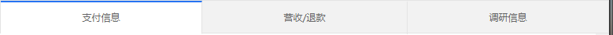
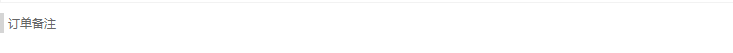
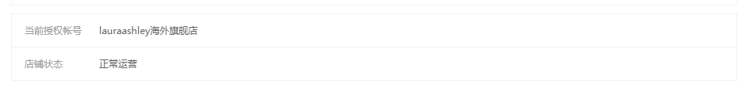

# 通用样式文档

## 横向tabs
### 样式展示

### 使用demo
```html
<div class="u-tabs">
    <ul>
        <li ng-class="{current:uiModel.choosen.childTabIndex == 0}">支付信息</li>
        <li ng-class="{current:uiModel.choosen.childTabIndex == 1}" >学员信息</li>
        <li ng-class="{current:uiModel.choosen.childTabIndex == 2}" >营收/退款</li>
        <li ng-class="{current:uiModel.choosen.childTabIndex == 3}" >调研信息</li>
    </ul>
</div>
```

## 数据展示/编辑

### 列表标题
#### 样式展示

#### 使用demo
```html
<div class="edit-title">
    订单备注
</div>
```

### 列表数据
#### 样式展示

#### 使用demo
```html
 <!-- 模拟右侧弹出框模块 -->
    <div class="slide-right-wrap js-slide-right-wrap slide-right-wrap-new" style="display: block;">
        <div class="slide-head">
            <div class="btn-close">
                <i class="icon-close" ng-click="detailsWrap.hide()"></i>
            </div>
            <h4 class="slide-title" ng-bind="item_news.customer" style="word-break:keep-all;white-space:nowrap;overflow:hidden;text-overflow:ellipsis;width:400px"></h4>
        </div>
        <div class="slide-cont">  //右侧详情去掉多余的div
                     <!-- 新孵化班 -->
                    <div class="detail-box">
                        <div class="list-group"> //如果用在右侧滑出详情请加类名right-detail，如果用在内容详情页请加类名main-content-detail
                            <div class="label-title">
                                <div><span class="icon-title"></span>基本信息</div>
                            </div>
                            <!-- grey样式用于使改行背景色改为灰色。 -->
                            <div class="list-item grey">
                                <span class="title">国家</span>
                                <span class="info">中国</span>
                            </div>
                            <div class="list-item">
                                <span class="title">省份</span>
                                <span class="info">{{baseModel.detail.province_name}}</span>
                            </div>
                            <div class="txt-textarea">    //文本展示
                                    <span ng-bind="detailsWrap.data.refund_reason">

                                    </span>
                            </div>
                        </div>
                    </div>
```