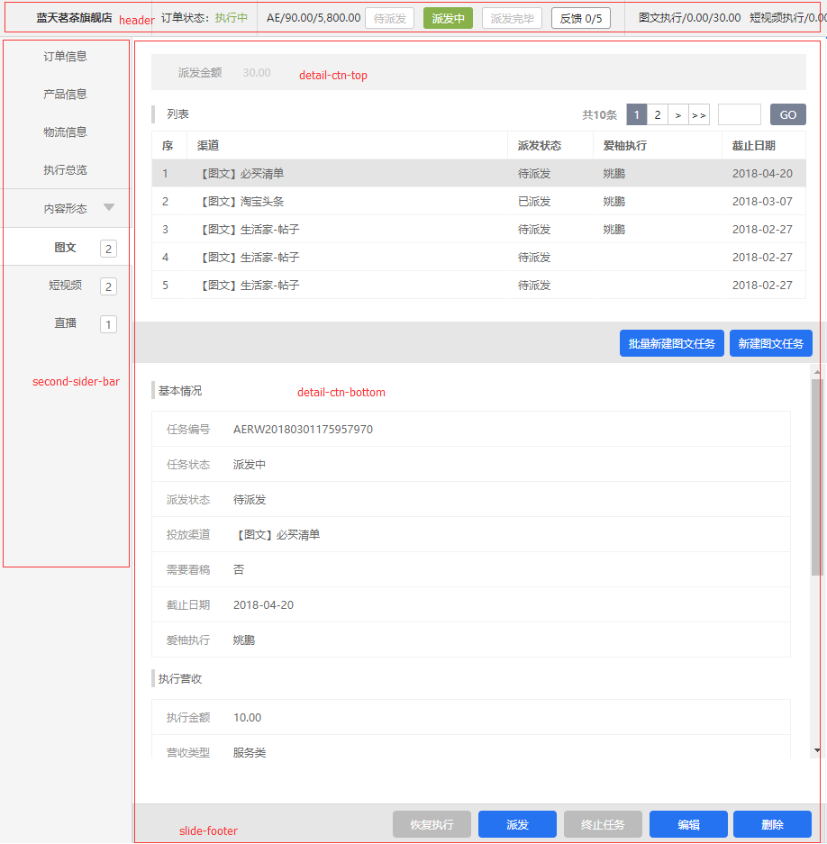

# content 容器（内容页2分，4分）

## 样式展示

## 使用demo
```html
<!-- 主路由渲染区域 -->
<!-- 如果底边存在footer。则需要加样式 .resize 提供底边高度。 -->
<div class="m-container resize">
    <header>
        ...
    </header>
    <div class="main-box">
        <div class="second-sider-bar">
            <!-- 二级菜单区域，若有 -->
        </div>
        <!-- 划分区块，若有侧边菜单栏，则加 .has-sider -->
        <div class="c-content has-sider">
            <!-- one-modul独占所有c-content区域 -->
            <!-- c-container 默认二分区块 -->
            <!-- normal-box 提供通用的容器间距。 border-r 提供左边框可能需要的右边border，这些都可删除 -->
            <div class="c-container normal-box border-r">
                <!-- 具体内容展示区域 -->
                <!-- 容器内存在footer 请添加 has-footer -->
                <div class="c-detail-ctn has-footer">
                    <!-- 若分上下部分 -->
                    <div class="c-detail-ctn-top"></div>
                    <div class="c-detail-ctn-bottom">
                        
                    </div>

                </div>
                <!-- 假设存在 silde-footer -->
                <div class="slide-footer normal-footer">
                    button...
                </div>
            </div>
            <div class="c-container"></div>
        </div>
    </div>
</div>
```

## 特殊样式说明（附图）
### .left-fixd,.right-fixed 
用于二分容器固定宽度的特殊用途

### 运营用特殊样式
* body .table-detail-list.refund-money
* .name-list