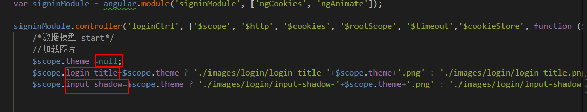
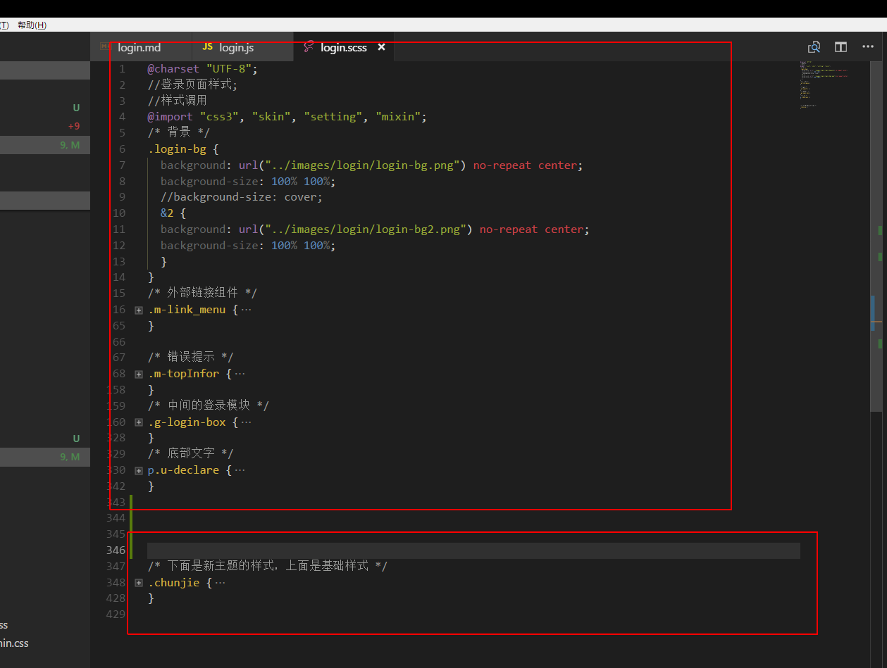

# login页面说明
# 作者周佳荣

## html
如果页面布局不改动html基本可以不动

## js

说明：
 
theme:为节日主题
>后面的login_title,input_shadow以及背景的保存图片的名称设置都需要带上主题

 
input_shadow：
&.active{
      box-shadow: 0 0 10px #7efbd8;
      }

## scss

说明：
 
上半部分为基础样式（每次节日过后，删除js内的theme即可完成还原）
 
下半部分为节日样式（原理就是覆盖原有样式，不明白的可参考chunjie来写）
