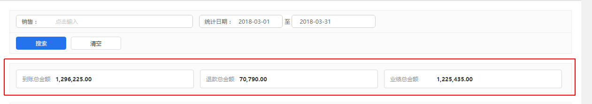

#我也不知道怎么形容

```html
<div class="next-list">
    <div class="next-list-box">
                <div class="form-group form-group-3">
                    <label>到账总金额</label>
                    <div ng-bind="list.totalList.total_received_amount | number:2"></div>
                </div>
                <div class="form-group form-group-3">
                    <label>退款总金额</label>
                    <div ng-bind="list.totalList.total_refund_amount | number:2"></div>
                </div>
                <div class="form-group form-group-3">
                    <label>业绩总金额</label>
                    <div style="margin-left: 111px;" ng-bind="list.totalList.taotal_reality_amount | number:2"></div>
                </div>
            </div>
</div>
```

如图：

